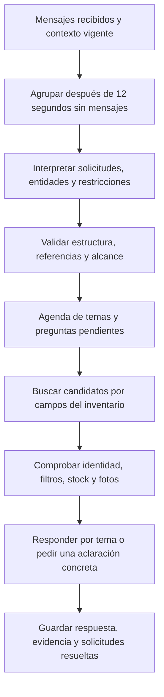

# BC: análisis de causas y prevención de errores de interpretación

Fecha: 18 de septiembre de 2026. Objetivo: resolver consultas comerciales variadas sin depender de añadir frases de conversación a listas de excepciones.

## Conclusión

El problema principal está en la arquitectura de interpretación. El bot mezcla comprensión del mensaje, clasificación de productos y filtrado del inventario. El texto que no reconoce suele convertirse en una condición obligatoria de búsqueda. Por eso una petición educada puede terminar en cero productos, mientras una aproximación ortográfica puede devolver un producto de otra familia.

La solución recomendada es un único intérprete de solicitudes con salida estructurada, seguido por un buscador que aplique restricciones verificables. La agenda debe conservar temas y preguntas; la base de datos debe seguir siendo la autoridad para precios, stock, publicación y fichas. Cambiar solamente el mensaje de error o el redactor final no corrige esa decisión previa.

Esta entrega contiene diagnóstico, evidencias y una auditoría reproducible. No sustituye todavía el intérprete de producción ni modifica la configuración de canales o el inventario.

## Evidencia y alcance

Se revisaron la agrupación de mensajes, la agenda, los dos caminos de catálogo, el índice comercial, la disponibilidad, la generación de PDF y la presentación de respuestas. La lectura del VPS confirmó la agenda habilitada.

- Aplicación auditada: `683eae27fa862fbd88da4bba1dfd56f592efc762`.
- Motor instalado al inspeccionar: `d8e607b6b2632a6feecca08e224ad83f4fad2a67`.
- Medición: `2026-09-18T07:01:37Z`, 02:01 en Lima.
- Se hicieron consultas de lectura; no se enviaron mensajes a clientes, generaron pedidos ni modificaron existencias.
- Había cambios simultáneos en otros archivos del workspace. No se incorporaron a la medición del VPS ni se editaron como parte de esta auditoría.

| Prueba nueva | Resultado | Qué significa |
| --- | ---: | --- |
| Reformulaciones de 130 búsquedas por categoría/marca | 910 | Siete formas de pedir el mismo alcance |
| Conservan exactamente los productos de la consulta corta | 260 | Pasan el saludo breve y las mayúsculas |
| Pierden todos los resultados al cambiar la redacción | 650 | Fallan cinco formas de cortesía/contexto en los 130 alcances |
| Controles con resultados esperados independientes | 16 | Productos ficticios, restricciones y agenda |
| Controles correctos / incorrectos | 7 / 9 | Hay fallos distintos de la redacción |

Ejemplo de reformulación: «catálogo categoría X» frente a «¿Sería posible que me compartieran catálogo categoría X cuando puedan?». Los 650 fallos no son una estimación de clientes mal atendidos: son pruebas sintéticas de estabilidad del buscador sobre el inventario actual. La referencia de esa prueba es el mismo buscador con una consulta corta, por lo que no certifica relevancia comercial. Los 16 controles adicionales sí tienen expectativas fijadas independientemente del resultado del buscador.

Existe además una [evaluación histórica de 150 conversaciones reales](2026-09-17-inbox-baseline.md), de una versión anterior: 75 casos pasan sus controles y 75 requieren corrección tras revisión semántica. No se reutiliza ese porcentaje como medición de la versión actual.

## Causas encontradas

| Causa | Evidencia reproducible | Cambio general necesario |
| --- | --- | --- |
| Palabras desconocidas se convierten en filtros | Las 650 reformulaciones terminan en cero resultados | Extraer entidades y restricciones; conservar texto incierto para aclaración, sin añadirlo automáticamente a la búsqueda |
| Corrección ortográfica sin control de familia | «shaver» encuentra un reloj por «SILVER» | Corregir dentro de familias/candidatos compatibles; no aceptar parecido ortográfico como identidad |
| Familia deducida del nombre con reglas incompletas | «audífonos JBL Bluetooth» incluye un adaptador; «TV» devuelve un TV Box | Tipo principal, subfamilia y relación de accesorio como datos del producto |
| Filtros compartidos no tienen alcance explícito | «cargadores y audífonos, todos hasta 100 soles» incluye un cargador de 150; «todos negros» incluye uno blanco | Restricciones globales y por producto separadas en una representación estructurada |
| Números sin unidad tipada | «hasta 100W» se interpreta como presupuesto máximo de 100 | Separar moneda, potencia, capacidad, tamaño, cantidad y modelo |
| Una intención desplaza a otra | Producto/precio + Yape conserva solo PAYMENT; producto + envío conserva solo SHIPPING | Varias solicitudes por mensaje, vinculadas a sus temas, sin exclusión entre consulta comercial y logística |
| Se agrupan mensajes en el tiempo, pero no siempre en significado | «quiero catálogo» / «de cargadores» / «y de audífonos» conserva un catálogo general y búsquedas aparte | Interpretar el conjunto de mensajes y sus continuaciones antes de crear solicitudes |
| Presentación global de resultados | Se limita a ocho productos antes de repartir por familia | Presentar opciones por cada tema y señalar explícitamente los que siguen pendientes |
| Duplicación de interpretación | Agenda, catálogo directo y motor antiguo aplican reglas distintas | Un plan comercial compartido; los canales de salida consumen ese plan |
| Caché de PDF depende de la frase | La huella incluye `content` | Identificar el documento por selección, filtros, formato y versión de datos, sin depender de la cortesía del mensaje |

Los controles del informe JSON reproducen nueve fallos de interpretación, clasificación y seguimiento. La duplicación de caminos, el límite global de ocho y la huella del PDF son hallazgos de revisión de código; en esta entrega no se midió su impacto integral adicional.

Archivos de referencia: [selección de catálogo](../../src/lib/catalog-selection.ts), [filtros comerciales](../../src/lib/commercial-query.ts), [agenda](../../src/lib/bc-request-agenda.ts), [procesamiento de solicitudes](../../src/app/api/internal/chat/requests/route.ts), [respuestas](../../src/lib/bc-request-answers.ts), [PDF](../../src/lib/catalog-pdf.ts).

## Calidad del inventario actual

La fotografía actual contiene 1.688 productos visibles, todos con stock positivo. 1.643 tienen alguna referencia de foto admitida y 45 no; esto no verifica que cada URL descargue una imagen válida.

El campo principal `brand` está vacío en 1.687 productos, pero muchas fichas ya tienen un atributo de marca: solo 806 carecen de ambos. Hay 1.379 fichas publicadas y únicamente cuatro productos sin especificaciones. Estos datos muestran cambios importantes respecto de la fotografía histórica; no corresponde seguir afirmando que casi todo el catálogo carece de ficha técnica.

La siguiente normalización debe separar marca real, compatibilidad, familia, modelo, versión, conectividad, potencia y capacidad. Debe registrar la procedencia y revisión de cada atributo. «SUPER CARGA» o «SUPER SI» no acreditan marca Super; «para Samsung» no acredita marca Samsung. Los nombres originales y códigos ERP deben conservarse.

Los alias comerciales pueden mantenerse como datos revisados —por ejemplo TV/televisor—. No deben mezclarse con un inventario creciente de frases de cortesía ni permitir que una familia absorba sus accesorios.

## Diseño recomendado



### 1. Interpretación del significado

El intérprete recibe los mensajes agrupados, los productos previamente mostrados y las solicitudes pendientes. Devuelve operaciones comerciales tipadas: catálogo, búsqueda, precio, disponibilidad, características, envío, pagos, selección, corrección o cancelación. Una consulta puede contener varias operaciones. La petición de detener el bot o hablar con un asesor conserva prioridad; cancelar una consulta no debe cancelar un pedido automáticamente.

Cada producto solicitado conserva tipo, marca, modelo, versión, atributos, exclusiones, cantidad y presentación. Cada restricción indica si aplica a toda la lista o a un tema concreto; cada referencia conserva los IDs de mensajes de origen. Los campos no resueltos se mantienen explícitamente inciertos.

La consulta original debe producir esta interpretación conceptual:

```json
{
  "operacion": "catalogo",
  "modalidad": "mayorista",
  "temas": [
    { "tipoSolicitado": "cargadores", "marcaSolicitada": null },
    { "tipoSolicitado": "fuentes de poder", "marcaSolicitada": null }
  ],
  "restriccionesCompartidas": [],
  "formato": "pdf"
}
```

Se evalúa usar IA para esta extracción mediante salida estructurada, limitada a interpretación. El esquema no debe permitir que el modelo proponga precios, stock o características como hechos. Debe admitir entrada ajena al comercio, falta de contexto, rechazo y extracción incompleta. La conformidad con JSON Schema no garantiza que la interpretación sea correcta; sigue siendo necesaria la validación de negocio. [OpenAI Docs: salidas estructuradas](https://developers.openai.com/api/docs/guides/structured-outputs).

La ruta principal auditada no tiene configurada una credencial de OpenAI. La activación de un intérprete con ese proveedor requiere configuración segura y una evaluación propia; este análisis no selecciona un modelo ni estima un costo sin medir las llamadas necesarias.

### 2. Búsqueda y comprobación

La recuperación debe trabajar con los campos extraídos. Cada tema se resuelve por separado; las alternativas se unen y los requisitos se intersectan. Marca, modelo, capacidad, versión, negaciones y presupuesto nunca deben desaparecer para conseguir resultados.

Un código literal tiene prioridad, conservando puntos, guiones y sufijos. La normalización lingüística se usa para nombres; no transforma identificadores ERP. Los candidatos aproximados necesitan compatibilidad de familia y restricciones verificadas. Si quedan dos modelos plausibles, se pide elegir entre ellos.

La identidad se comprueba antes de la disponibilidad. El resultado debe distinguir `encontrado`, `agotado`, `sin foto válida`, `varios modelos`, `sin coincidencia verificada`, `petición incompleta` y `fallo técnico`. No se debe concluir «no tenemos» cuando el sistema no entendió la consulta o falló la generación del documento.

Para catálogos con varias familias, se conserva el resultado de cada una. Un PDF puede cubrir lo encontrado y explicar qué parte sigue pendiente. Una lista breve debe reservar opciones para cada familia; no entregar ocho productos de la primera marca y omitir las demás solicitudes.

### 3. Conversación y salida

La agenda existente, el bloqueo por conversación, la espera de 12 segundos y el control de respuestas obsoletas son bases útiles. Deben conservarse. El cambio está en convertir el lote de entrada en un plan común, evitando volver a interpretar independientemente cada fragmento en el buscador.

«Dos unidades», «el segundo», «solo negros», «y cuánto cuesta el envío» y una corrección de modelo deben actualizar el tema correspondiente. Resolver el pago no cancela la consulta de precio. Una ambigüedad requiere una pregunta puntual sobre ese tema.

El redactor recibe hechos ya verificados y pendientes explícitos. Mantiene el saludo horario, adjunta el catálogo o la imagen y responde cada solicitud una vez. Antes de enviar, se comprueban cambios de stock/precio y la llegada de mensajes nuevos. La caché del PDF usa productos y versión de datos, preservando las restricciones comerciales y la política actual de fotos.

## Cómo prevenir regresiones

La prevención debe medir interpretación, selección y respuesta por separado. Se conserva el corpus de conversaciones reales, se añaden casos de riesgo con expectativas independientes y se prueban variaciones que no deberían cambiar el resultado. La documentación oficial recomienda evaluaciones específicas de la tarea, datos de producción y revisión humana junto con métricas. [OpenAI Docs: prácticas de evaluación](https://developers.openai.com/api/docs/guides/evaluation-best-practices).

Condiciones propuestas para liberar la sustitución del intérprete:

1. Pasar los 16 controles definidos, sin saltarse los casos fallidos. Añadir variantes independientes de esos riesgos.
2. Conservar la selección en las reformulaciones equivalentes por categoría y marca. El porcentaje de esta prueba no reemplaza una evaluación de relevancia.
3. Ninguna violación en pruebas de SKU, modelo, versión, capacidad, presupuesto, negación, visibilidad y disponibilidad.
4. Cada familia y solicitud debe quedar respondida o explícitamente pendiente. Medir esto por objetivo, no solo por conversación.
5. Comparar precisión y cobertura con etiquetas revisadas contra la misma fotografía de inventario. Congelar nuevos casos no utilizados durante el desarrollo.
6. Validar catálogos por su contenido y evidencia de productos, además de descarga válida. Medir duplicados y latencia con caché fría y caliente.
7. Repetir casos de corrección, llegada de mensajes durante generación, transferencia a asesor, audio y fotos. La auditoría nueva de esta entrega solo cubre texto y funciones de búsqueda/agenda.

Una caída del proveedor de IA o una extracción inválida debe producir un estado explícito de aclaración o derivación. No debe convertir una búsqueda incompleta en una afirmación de inexistencia ni activar operaciones de compra por su cuenta.

## Orden de implementación

| Etapa | Entregable verificable |
| --- | --- |
| A | Contrato común de solicitudes, restricciones con unidades y resultados con motivo; pruebas independientes de cada campo |
| B | Normalización de familias/atributos y verificador de restricciones, utilizado por todos los caminos |
| C | Intérprete estructurado conectado a la agenda en el simulador, con trazabilidad hasta el mensaje de origen |
| D | Comparación con la evaluación previa y un conjunto nuevo congelado; revisión de resultados por familia |
| E | Unificación de salidas, caché por selección y despliegue gradual con métricas y reversión |

Mejorar el mensaje de error puede acompañar este trabajo, pero no acredita que el bot haya comprendido la consulta. La siguiente implementación debe poder mostrar que una misma intención conserva sus productos aunque cambie la forma de escribirla.

## Artefactos y reproducción

- [Resultados de esta auditoría](prevention-2026-09-18.json): resumen, ejemplos y los 16 controles.
- [Auditor reutilizable](../../scripts/bc-evaluation/prevention-audit.cjs): lectura del inventario, pruebas de reformulación y controles independientes.
- [Pruebas del auditor](../../scripts/bc-evaluation/prevention-audit.test.cjs): detecta productos perdidos/adicionales y evita contar una búsqueda vacía como éxito.
- Informe completo privado: `/home/IMPORTADORA/.cache/bc-prevention-20260918/report.json`.

```sh
node --import tsx --test scripts/bc-evaluation/prevention-audit.test.cjs
node --import tsx scripts/bc-evaluation/prevention-audit.cjs --read-only-inventory --output .cache/prevention-report.json
```

La opción `--enforce` hace fallar el comando si las reformulaciones o los controles no cumplen. Se ofrece como puerta de evaluación; no se ha conectado automáticamente al despliegue de otros cambios. La versión auditada no pasa esa puerta. Las ejecuciones futuras registran revisión y hashes de los módulos para distinguir cambios de código y de inventario.
