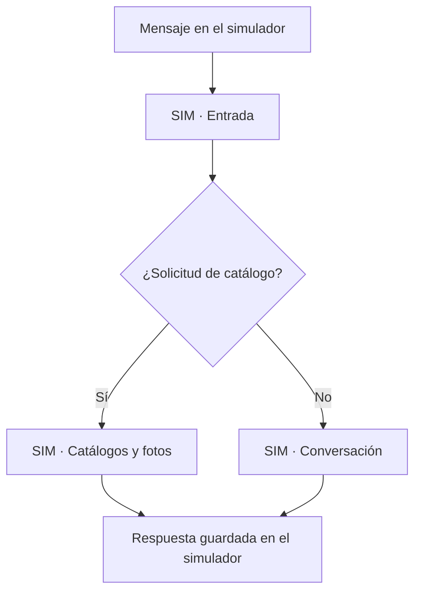
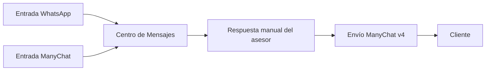

# Flujos del bot: uso actual y vista simplificada

Auditoría del 17 de septiembre de 2026, aproximadamente a las 03:55 de Perú. Revisión de solo lectura de la API de n8n, versiones publicadas, conexiones, ejecuciones guardadas, configuración del VPS, procesos PM2, rutas de Nginx y estado del módulo de automatizaciones en PostgreSQL.

## Resultado

Los 16 flujos visibles se pueden presentar como **6 principales, 9 fuera del recorrido actual y 1 pendiente de revisión**. Además hay 4 flujos ya archivados, fuera de la captura. De los 16 visibles, 11 están publicados y 5 inactivos. Estar publicado no demuestra que un flujo reciba mensajes.

Cinco de los seis principales tienen ejecuciones recientes guardadas. El puente de entrada de ManyChat debe conservarse, pero su tráfico reciente no quedó confirmado: no guarda ejecuciones exitosas. No se ha modificado, desactivado, archivado ni ejecutado ningún flujo durante esta auditoría; tampoco se han enviado mensajes.

## Los seis que conviene tener a la vista

| Flujo actual | Función y evidencia | Nombre sugerido |
| --- | --- | --- |
| [BC - Simulador - Entrada](https://n8n.tiendavirtualsuper.com/workflow/HVFMz7fCQXRNXB3U) | Recibe el mensaje del panel de pruebas, valida que sea una simulación, lo guarda y selecciona catálogo o conversación. 76 ejecuciones guardadas; la última terminó correctamente. | `SIM · 01 Entrada` |
| [BC - Simulador - Motor conversacional](https://n8n.tiendavirtualsuper.com/workflow/YXvIlOEj45LpjONf) | Atiende las consultas que no van a la rama de catálogo: agrupa mensajes, consulta el estado comercial y utiliza el motor del servidor. Guarda la respuesta en el simulador. 30 ejecuciones guardadas, todas correctas. | `SIM · 02 Conversación` |
| [BC - Simulador - Catálogo PDF](https://n8n.tiendavirtualsuper.com/workflow/JMBAcoKFStcNFfFm) | Consulta el generador de catálogo filtrado y registra los resultados de prueba. Aunque su nombre dice PDF, el servicio también puede devolver imágenes para solicitudes compatibles. 45 ejecuciones guardadas, todas correctas. | `SIM · 03 Catálogos y fotos` |
| [01 - Incoming Messages](https://n8n.tiendavirtualsuper.com/workflow/EZaAQCCbY3qWIWY1) | Entrada real por el webhook de WhatsApp: normaliza datos, consulta la vinculación de ManyChat y persiste mensajes en el Centro de Mensajes. Tiene historial reciente. Sus llamadas al router antiguo y al catálogo de proyectores están desconectadas. | `REAL · 01 Entrada WhatsApp` |
| [ManyChat → Centro de Mensajes (inbound)](https://n8n.tiendavirtualsuper.com/workflow/386c7deddf33dbb8) | Puente publicado para recibir directamente desde ManyChat y guardar la entrada. Conservación recomendada. Cero ejecuciones devueltas por la API no demuestra desuso, porque tiene deshabilitado el guardado de éxitos. Su llamada al catálogo de proyectores está desconectada. | `REAL · 02 Entrada ManyChat` |
| [STAGING - Outbound Messaging ManyChat v4](https://n8n.tiendavirtualsuper.com/workflow/fMANAA76DedfoMkQ) | Es el destino configurado de envío del servidor web y de su proceso PM2. Se utiliza para la salida real del Centro de Mensajes. Tiene 7 ejecuciones guardadas, todas correctas. **El prefijo STAGING ya no describe su uso actual.** | `REAL · 03 Envío de mensajes` |

## Nueve fuera del recorrido actual

Estos flujos se pueden separar de la vista cotidiana. La clasificación indica su participación en el recorrido verificado; no prueba la inexistencia de cualquier consumidor externo desconocido de un webhook.

| Flujo | Estado comprobado | Tratamiento sugerido |
| --- | --- | --- |
| [03 - Conversation Router V2 - STAGING](https://n8n.tiendavirtualsuper.com/workflow/19jLl9xVWxDslVVL) | Publicado, pero su llamada desde la entrada real está desconectada. BC usa su propio motor de simulación. La última ejecución guardada comenzó el 16/09 a las 22:26 de Perú. | Histórico; conservar como referencia de la atención real anterior. |
| [Catálogo automático de proyectores](https://n8n.tiendavirtualsuper.com/workflow/cAtPr0jPdf202609) | Publicado; sus llamadas desde las dos entradas reales están desconectadas. El simulador usa el catálogo nuevo. Última ejecución guardada: 16/09 a las 22:26. | Histórico. |
| [STAGING - Outbound Messaging v3 CLEAN](https://n8n.tiendavirtualsuper.com/workflow/YwSoeCWb8Joo3RAR) | Publicado; lo llama el router antiguo, que quedó fuera de la entrada real. El servidor web utiliza v4. Última ejecución guardada: 16/09 a las 22:26. | Histórico; revisar junto con el router antiguo antes de desactivarlo. |
| [04 - Product Search](https://n8n.tiendavirtualsuper.com/workflow/KLb2eUqmr2JVRK4R) | Publicado; se inicia mediante otro workflow, sin llamadas encontradas en los flujos revisados y sin ejecuciones guardadas. No forma parte del recorrido de BC. | Histórico; el bot conserva la búsqueda a través del motor y las API de productos. |
| [STAGING - Outbound Messaging v2](https://n8n.tiendavirtualsuper.com/workflow/0CsBu1UDocZJubaM) | Inactivo, sin llamadas encontradas ni ejecuciones guardadas. Su recorrido utiliza una respuesta simulada de Meta. | Candidato claro a archivo. |
| [Temporary lookup Leon by phone](https://n8n.tiendavirtualsuper.com/workflow/cef2ca1a7f5c8253) | Consulta manual de diagnóstico, inactiva y sin llamadas encontradas. | Candidato claro a archivo. |
| [Temporary lookup Leon ManyChat](https://n8n.tiendavirtualsuper.com/workflow/0a2162276a6977e8) | Consulta manual de diagnóstico, inactiva y sin llamadas encontradas. | Candidato claro a archivo. |
| [Temporary ManyChat subscriber lookup (current contact)](https://n8n.tiendavirtualsuper.com/workflow/890ba76f16b54dee) | Webhook de diagnóstico inactivo, sin llamadas encontradas. | Candidato claro a archivo. |
| [Verificación completada - Contacto 1906562052](https://n8n.tiendavirtualsuper.com/workflow/qaCgdSLOCRaIxpHi) | Inactivo, sin nodos operativos ni conexiones. | Candidato claro a archivo. |

## Uno que conservaría en revisión

[Outbound Messaging](https://n8n.tiendavirtualsuper.com/workflow/dCECdX9nMtQEbBUy) está publicado y no tiene ejecuciones guardadas en la consulta. El servidor web usa v4, pero el entorno y el proceso PM2 del motor antiguo todavía apuntan a este webhook. Nginx dirige al motor las rutas de `router-v2` y `sales-state`; la mensajería administrativa normal va al servidor web. Esa referencia residual impide clasificarlo como eliminable sin revisar antes sus consumidores. Nombre sugerido: `REVISAR · Envío anterior`.

## Cómo se comporta BC actualmente

La rama de catálogos consulta `/api/internal/catalogs/products`; la rama conversacional consulta el motor del servidor, que maneja el contexto comercial, productos, precios, envíos y los pasos de compra simulados. Ambas guardan respuestas mediante `/api/internal/chat/simulator-batch`. No contienen nodos de envío a WhatsApp o ManyChat. Las simulaciones de compra no crean pedidos reales, según la implementación y las verificaciones documentadas del simulador.

En la configuración verificada, los mensajes reales se guardan y el asesor puede responder. Las entradas reales no llegan al router ni al catálogo automáticos antiguos. El interruptor general del bot está encendido, pero `AUTOMATIONS_WHATSAPP_ENABLED=false` y la tabla de automatizaciones está vacía. Por tanto, **BC no está conectado para responder automáticamente a los clientes por este recorrido**. Las automatizaciones que pudieran existir dentro de ManyChat están fuera del alcance de esta revisión.

## Vista recomendada

- **Bot en pruebas:** los tres flujos `SIM`. Esta sería la vista predeterminada para entender y ajustar el comportamiento de BC.
- **Mensajería real:** los tres flujos `REAL`. Muestran recepción y envío, separados de la lógica de conversación en pruebas.
- **Histórico y diagnóstico:** los nueve que no participan en el recorrido actual.
- **Por revisar:** el envío anterior con la referencia residual del motor.

La propuesta puede aplicarse con agrupación o etiquetas y, donde corresponda, archivado reversible. Los nombres anteriores son sugerencias: no se han aplicado cambios a n8n. Cambiar la organización visual no implica activar la atención automática real.

## Límites de la evidencia

- Se comprobaron los 20 workflows devueltos por la API sin paginación pendiente. Las versiones publicadas de los 11 workflows activos visibles coinciden con sus versiones guardadas.
- Las conexiones se trazaron desde sus disparadores: un nodo que permanece dibujado pero no tiene un camino de entrada no participa en la ejecución normal.
- Se consultaron hasta 100 ejecuciones guardadas por flujo. Las cifras son registros disponibles, no un total de mensajes, usuarios, entregas ni actividad histórica completa.
- La entrada WhatsApp, la entrada ManyChat y el router antiguo tienen deshabilitado el guardado de ejecuciones exitosas en su configuración actual. El historial puede contener éxitos guardados con configuraciones anteriores. Por eso, ausencia de historial y conteos de errores no se utilizan solos para decidir desuso o calidad del servicio.
- Las siete ejecuciones correctas de v4 prueban actividad del flujo; no se interpretan como siete clientes distintos ni como confirmación independiente de entrega.
- No se probaron webhooks durante la auditoría. La configuración de consumidores externos dentro de Meta/ManyChat no se inspeccionó.

Referencias del proyecto: [simulador](bc-simulator/README.md), [verificaciones del simulador](bc-simulator/verification.md) y [módulo de automatizaciones](../automations.md).
