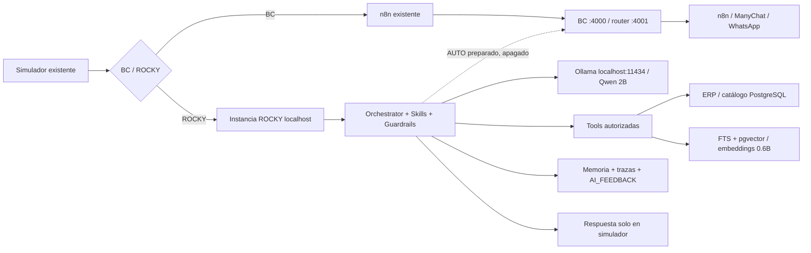

# Entrega ROCKY — 21 de septiembre de 2026

ROCKY está integrado en el simulador existente, con selección de motor BC/ROCKY. El envío autónomo a clientes reales permanece apagado. Esta entrega es una base operativa para pruebas comerciales supervisadas; las integraciones que todavía requieren validación se detallan expresamente.

Acceso: https://tiendavirtualsuper.com/admin/mensajes/simulador, con sesión administrativa. Seleccionar **ROCKY · pruebas IA**.

| # | Punto solicitado | Resultado |
|---|---|---|
| 1 | Arquitectura original | Next.js 16.2.4, Prisma 6, PostgreSQL 16, BC propio, n8n, WhatsApp/ManyChat y ERP. Se reutilizaron búsqueda, catálogo y memoria existentes. |
| 2 | Función real de BC | Persistencia y control humano, agenda comercial, carrito/pedidos, recepción, outbox y entrega. También existe piloto real; no se asumió que todo BC fuese solo simulación. |
| 3 | n8n encontrado | Se consultaron nombres/activación de 20 workflows. Incluyen Incoming Messages, Router V2 STAGING, Product Search, tres flujos BC Simulador, ManyChat inbound y Outbound ManyChat v4. Se conservó todo. La auditoría de conexiones detallada previa está en `docs/n8n/estado-flujos-2026-09-17.md`; no se presenta como nueva comprobación de todas las conexiones. |
| 4 | Bajo ROCKY | Planificación estructurada, intención, selección de Skill, consultas autorizadas, comparación, memoria selectiva, sugerencia sustentada, handoff, trazas, feedback y analytics. |
| 5 | Bajo BC | Identidades, conversaciones/mensajes, autoridad humano/bot, pedidos y ejecución/entrega comercial. |
| 6 | Bajo n8n | Automatizaciones y transportes actuales. Registry de acciones preparado para un webhook de consulta dedicado; no se otorgó acceso general ni se publicó un workflow nuevo. |
| 7 | Modelo instalado | Descargados Qwen 3.5 9B, 4B y 2B. Se usa temporalmente **2B**, por evidencia de memoria/latencia del VPS compartido. 9B no se cargó. |
| 8 | Embeddings | `qwen3-embedding:0.6b`, salida de 1024 dimensiones verificada. Modelo independiente. |
| 9 | RAM | Baseline: 6,7 GiB usados / 8,9 GiB disponibles, swap casi lleno. Servicio durante benchmark 2B: pico ~4,44 GiB; límites High 5G / Max 6G / SwapMax 0. Evidencia en los JSON de benchmark. |
| 10 | CPU | VPS 4 vCPU. Ollama limitado a 200% y dos hilos por inferencia. Durante ingesta se observaron ~176% en el runner, con la tienda respondiendo. Es una muestra, no p95 de producción. |
| 11 | Disco | Modelos: ~17 GiB en total, incluyendo el Qwen 2.5 preexistente. Releases y medición final se registran en `vps-final.txt`. No se borraron modelos ni datos anteriores. |
| 12 | Prisma | Relaciones añadidas a Conversation/ChatContact y siete modelos nuevos; ningún campo anterior eliminado. |
| 13 | Tablas | RockySession, RockyCustomerPreferences, RockyRun, RockyFeedback, RockySynonym, knowledge_documents, knowledge_chunks y knowledge_embeddings. Migración aplicada tras backup completo de PostgreSQL de ~19 MiB. |
| 14 | Endpoints | chat, health, embed, rag/search y rag/index internos; `/api/admin/rocky` para diagnóstico/feedback/modos; simulador administrativo adaptado. |
| 15 | Tools | Búsqueda, lectura por ID/código/modelo inequívoco, stock, precio, comparación, RAG y handoff. Promociones y compatibilidad no se afirman sin adaptadores/evidencia. Pedidos, checkout y envíos multimedia siguen cerrados a ejecución autónoma. |
| 16 | Skills | 19 Skills declarativas versionadas, con herramientas y restricciones. Las políticas de cross-selling, upselling y cierre están preparadas; no implican compras autónomas habilitadas. |
| 17 | RAG | PostgreSQL + pgvector, limpieza/chunks, indexación incremental, exact/FTS/vector/hybrid y filtros. Corpus completo del catálogo visible: 1.679 documentos y 1.680 fragmentos con embeddings; ingesta finalizada sin errores. No se inventaron políticas de garantía, pagos, delivery o devolución. |
| 18 | Memoria | Sesión comercial acotada, recuperación de memoria BC y preferencias explícitas por contacto. Revalidación de turno, revisión, control humano e inventario antes de guardar. |
| 19 | Analytics | Intenciones, productos, comparaciones, búsquedas sin resultado, vocabulario/frases, objeciones, recomendaciones y derivaciones; agregación de últimas 1.000 ejecuciones. Outcomes de conversión solo por feedback explícito. |
| 20 | Feedback | Cola AI_FEEDBACK, original IA asociado al run, respuesta humana, revisor/outcome/contexto. Corrección disponible en el simulador. Sinónimos aprendidos requieren frecuencia y aprobación; diccionario inicial proviene de los ejemplos del usuario. |
| 21 | Tests ejecutados | Suite funcional/seguridad y regresiones BC, integración PostgreSQL+pgvector aislada, compilación local/Linux, ESLint, pruebas Ollama y simulador HTTP reales, verificación HTTPS de HTML y assets. |
| 22 | Tests exitosos | **40/40** unitarios/regresiones. Integración SQL pasó exact/lexical/vector/hybrid, filtros, ocultos, idempotencia, modo manual, feedback y modelos ambiguos. Compilación y lint sin errores. HTTP: simulador 200, 17 assets correctos, tienda 200, endpoint interno sin clave 401. |
| 23 | Pendientes | Corpus comercial aprobado, verificación de identidad/pedidos, promociones autorizadas, compatibilidad crítica y conectores de acciones. Audio/STT y documentos/redes/video quedan como interfaces futuras. No hubo sesión de navegador administrativa disponible para una prueba visual interactiva; sí se verificó HTML autenticado, assets y API real. |
| 24 | Riesgos | 2B necesita evaluación de vendedores; confianza heurística sin calibrar. CPU compartida limita velocidad. La ingesta incremental requiere nueva ejecución tras cambios editoriales ERP. Rate limit por proceso, a distribuir si se escala. AUTO requiere desplegar conjuntamente el hook de BC y sus flags; no activar únicamente el flag de la instancia del simulador. |
| 25 | Próximo paso | Probar casos reales en el selector ROCKY, corregir respuestas y cargar políticas comerciales aprobadas. Evaluar después un piloto AUTO acotado; para 9B, más RAM libre o servidor GPU separado. |

## Resultados concretos

- El simulador consultó un cargador real dentro de presupuesto y guardó su precio/stock desde PostgreSQL, sin enviar a WhatsApp.
- Las pruebas reales de recuperación identificaron que LK618 corresponde al código ERP N1052; se corrigió la resolución por modelo y se exige unicidad.
- «Booster» y «aparato para prender el carro» ahora recuperan el arrancador N1052 mediante la expansión inicial revisada. No se afirma que el modelo haya aprendido esos sinónimos por sí solo.
- Qwen 4B excedió 100 s en el benchmark inicial; 2B terminó la prueba breve en 6,42 s. La conversación completa de búsqueda tardó alrededor de 22 s durante las pruebas; no confundirla con el benchmark de una frase.
- La última verificación de stock por modelo tardó 132 ms, usando reglas y herramientas sin inferencia. La búsqueda completa con Qwen tardó 19,9 s. Son muestras, no percentiles de producción.
- Se corrigió el precio mayorista cero para conservar el precio unitario, igual que BC.
- No se habilitó envío AUTO real, ni se ejecutaron compras, descuentos, cambios de inventario o ediciones de workflows.

## Diagrama real

Operación, configuración, seguridad y reversión: [README.md](README.md). Las mediciones y pruebas se conservan junto a este reporte.
